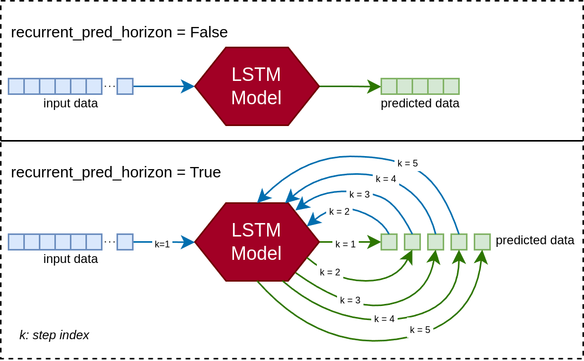
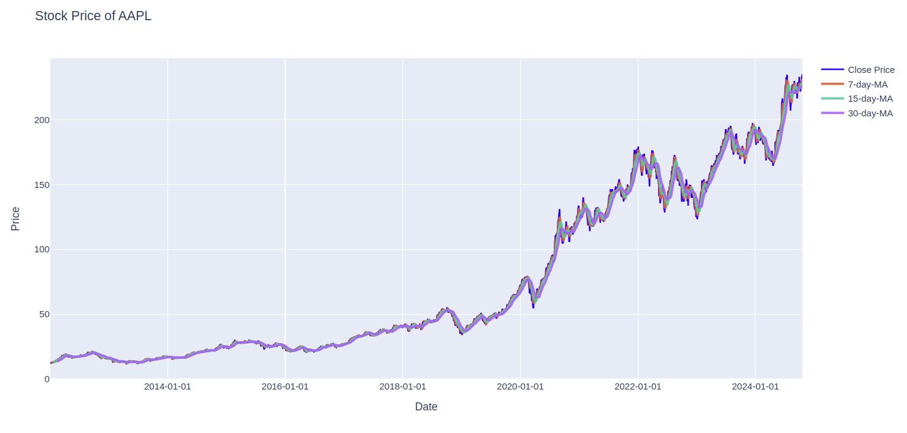
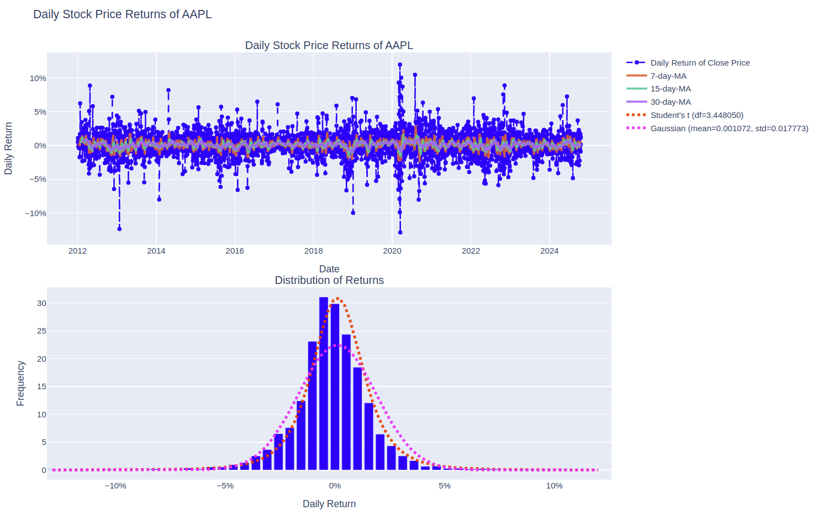
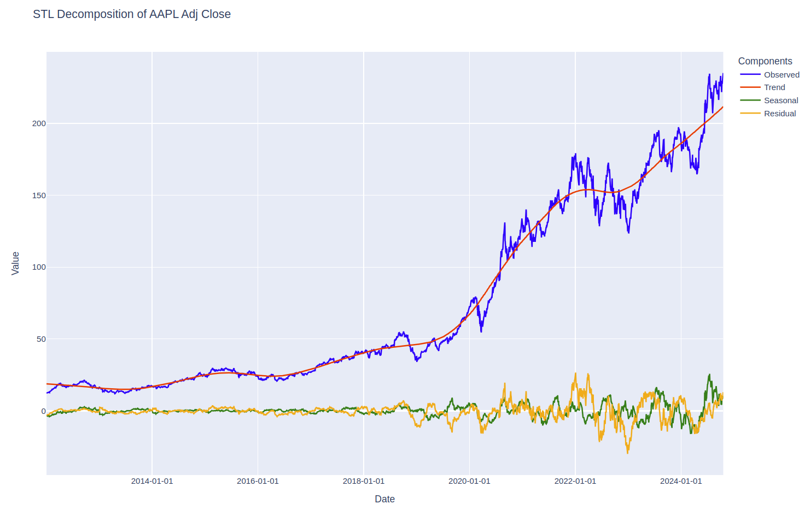

# Stock Price Prediction with Machine Learning

_Author: Jan Xu_
_Release date (v1.0.0): 21-10-2024_

This project is a mix of learning time-series ML, testing out my new GPU, and maybe making some money with minimal effort.

This README explains what I've done and how to use the components.

---

## Project Description

In this project, I aim to predict future stock prices using historical data with an LSTM-based model.

**What data are we using?**

The stock data is fetched from [Yahoo! Finance](https://pypi.org/project/yfinance/) using the `fetch_stock_data.py` script, which allows for EDA and saves the data in a local SQLite database for the training pipeline.

For a given ticker, the data includes daily stock prices (open, high, low, close) and volume. The model uses _daily returns_ as the main predictor and target variable:

`daily_return [%] = 100% * (today_stock_price - yesterday_stock_price) / yesterday_stock_price`

We normalise the return data using historical mean and standard deviation for training.

**What models are we using?**

The repo currently includes two RNN-based models:

1. **LSTM model**: A vanilla LSTM with a linear output layer (see `LSTMModel` in `models/lstm.py`)
2. **CNN-LSTM model**: Adds a 1D-Conv pre-processing module for autocorrelation/lagged time dependencies (see `CNNLSTMModel` in `models/lstm.py`).

By default, both models predict the next day's stock price (`pred_horizon = 1`). For multi-day prediction, two modes are supported:

- `recurrent_pred_horizon = False`: Predicts all days at once.
- `recurrent_pred_horizon = True`: Predicts recurrently by feeding the previous prediction as input until the desired horizon is reached.



Currently, models only support univariate inputs, however extending to multivariate inputs is a future consideration. Note that if `recurrent_pred_horizon = True`, `input_size == output_size` is required.

**How do we train the model?**

The `train_model.py` script trains the model using MSE loss between predicted and actual returns. We use a (default) batch size of 64, a look-back size of 64, and the Adam optimizer with an initial learning rate of `1e-3`, which drops by factors of 10 at 60% and 80% of training.

**What evaluation methods are we using?**

During training, we use time-series cross-validation to evaluate the model (details in [`data/dataset/cross_validation.py`](../data/dataset/cross_validation.py)). The main loss metric is MSE, although this can be a bit hard to interpret.

A better metric is what I called `gain_loss`, which is defined as:

`loss_gain = loss / baseline_loss - 1`

Here, `loss` is the MSE, and `baseline_loss` is `MSE(input, zeros_like(input))`. This "normalized error" shows when the model performs better than predicting a 0% daily return (no stock price change).

Here, `loss` is the MSE and `baseline_loss` is defined as `MSE(input, zeros_like(input))` which represents the "energy" of the original signal**. We can consider `loss_gain` to be a "normalised error" shifted by 1, indicating when the model predicts "better" (`loss_gain < 0`) than the best heuristic (predicting a 0% daily return, or no stock price change).

****NOTE:** Since `input` is a normalised variable, in the limit of infinite data points `baseline_loss` should simply equate to 1. However, since we evaluate on a smaller validation set, the `baseline_loss` is not necessarily equal to 1, giving validity to our `loss_gain` metric.

Other metrics include:

- `accuracy_pct` [%]: Directional accuracy of predicted returns
- `RMSE`: Root mean squared error
- `MAE`: Mean absolute error
- `MAPE` [%]: Mean absolute percentage error; this should ideally be less than the average fluctuation in daily returns

These are calculated for both single-day and multi-day predictions.

---

## Installation

The project is in Python 3 and mainly uses PyTorch. Install dependencies with:


```bash
pip install -r requirements.txt
```

For tracking experiments with [Weights & Biases](https://wandb.ai/), run `pip install wandb` and follow [setup instructions](https://docs.wandb.ai/quickstart/).

---

## Usage

**Toy dataset**

Run a toy model with:

```bash
python train_model.py --TOY
```

This uses synthetic stock price data (see toy/synthetic.py). Output is saved in runs/<RUN_NAME>, including figures and supplementary material.

This uses synthetic stock price data (see [`toy/synthetic.py`](../toy/synthetic.py)). Outputs are saved in runs/<RUN_NAME>, including figures and supplementary material.

To perform exploratory data analysis (EDA) before training, add the --eda flag.

For more arguments, use `-h / --help` or see [`arguments.py`](../arguments.py).

**Real stock price datasets**

Fetch real stock data with the fetch_stock_data.py script. Choose a ticker (e.g., AAPL) and a start date:

In order to use real stock price datasets, we must first invoke the `fetch_stock_data.py` script to interface with a local SQLite database. Choose a ticker (e.g., `AAPL`) and a start date:

```bash
python fetch_stock_data.py -t AAPL --start 2012-01-01
```

Add the --dbsave flag to save data to the database and CSV file.

Once we have created a local database, to train the model on real stock data we use:

```bash
python train_model.py -t AAPL
```

For Wandb logging, add --wandb with project name (-p) and run name (-n). Either way, predictive scores during training and validation are always outputted to the console.


****NOTE:** EDA can also be performed using `--plot` in `fetch_stock_data.py` or `--eda` in `train_model.py`. For the latter, EDA will run before training ensues (after a user input).

The EDA includes moving average curves, daily return plots (fitted with Student's t-distribution and Gaussian), and [STL decomposition](https://otexts.com/fpp2/stl.html).

_Stock price plot (with moving averages) example_



_Daily return plot (with fitted distributions) example_



_STL decomposition example_



---

## Future Work

While the models and code work as expected, predictive power is still weak and suffers from overfitting. Potential improvements include:

**Model/training improvements**
1. Multivariate / auxiliary input variables, such as day of the week, sentiment analysis data of news sources, fundamental analysis data (potentially training with deliberate data omissions in order to account for multi-day predictions)
2. Try other model types: BiLSTM, GRU, ConvLSTM or even Transformers
3. Multi-stock models (ideally with correlated stocks) to combat overfitting with larger datasets

**Interface improvements**
1. Model saving and loading functionality
2. More human-friendly database API
3. Evaluation on test sets
4. Batch job script for large-scale studies

**Performance improvements**
1. Increase GPU utilisation (currently under 100%)
2. Speed up `--recurrent-pred-horizon` training, which is currently very slow (e.g. parallel Jacobi iterations)